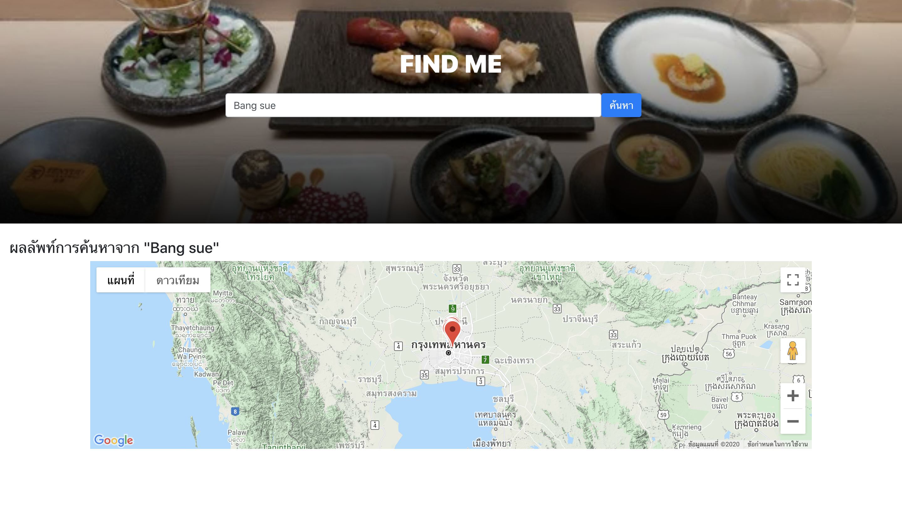

# Restaurant Web

## Prerequire

- Node.js and npm

## Run Project

1. install dependencies

```
npm install
```

2. สร้าง file .env ที่ root project โดยให้ทำ api key ของ google map api for JavaScript มาใส่เป็น value (แต่ถ้าไม่มี ขอมาทางผมได้ครับ)

```
GOOGLE_MAP_API_KEY={GOOGLE_MAP_API_KEY}
```

3. run dev server

```
npm run dev
```

default dev server will start at http://127.0.0.1:3000/

## Relate file

- vue.config.js

```javascript
export default {
  // ...
  plugins: [
    '@/plugins/vue-google-map.js' // เป็น component library สำหรับแสดง Google Map UI
  ],

  buildModules: [
    // ...
    '@nuxtjs/dotenv' // เป็นตัวอ่านไฟล์ .env เข้ามาใน process
  ],
  modules: [
    // ...
    '@nuxtjs/proxy' // ใช้ rewrite path เพื่อแก้ปัญหาการติด CORS ตอน develop
  ],
  proxy: {
    '/api/': 'http://127.0.0.1:8000/'
  },
  // ...
  build: {
    transpile: [/^vue2-google-maps($|\/)/]
  }
}
```

- plugins/vue-google-map.js

```javascript
// register lib google map
import Vue from 'vue'
import * as VueGoogleMaps from '~/node_modules/vue2-google-maps'

Vue.use(VueGoogleMaps, {
  load: {
    key: process.env.GOOGLE_MAP_API_KEY,
    libraries: 'places',
    installComponents: true,
    language: 'th'
  }
})
```

- store/index.js

```javascript
// ทำ store เพื่อที่จะเก็บ list ของ restaurant และ next page token ของ google place API
// แต่สุดท้าย จะมีบางส่วนที่ไม่ถูกใช้ เพราะมีแต่ page เดียว และไม่ได้ทำ lazy load
export const state = () => ({
  restaurants: [],
  nextPageToken: null
})

export const getters = {
  restaurantByID (state) {
    return state.restaurants
      .find(restaurant => restaurant.place_id)
  }
}

export const mutations = {
  clearRestaurant (state) {
    state.restaurants = []
  },

  setRestaurant (state, restaurants) {
    state.restaurants = [...state.restaurants, ...restaurants]
  },

  setNextPageToken (state, nextPageToken) {
    state.nextPageToken = nextPageToken
  }

}
```

- pages/index.js

เป็นหน้าหลักในการแสดงผล

```vue
<template>
  <div>
    <div class="home-image-bg-search">
      <div class="container-fluid">
        <div class="row">
          <h1 class="col-sm-12 text-center home-header">
            FIND ME
          </h1>
        </div>
        <div class="row py-3">
          <span class="col-sm-3 col-0" />
          <div class="col-sm-5 col-10 px-0 position-relative">
            <b-form-input
              v-model="placeText"
              type="search"
              placeholder="กรุณาระบุร้านอาหารที่คุณต้องการค้นหา"
            />
          </div>
          <div class="col-sm-1 col-2 px-0 position-relative">
            <b-button variant="primary" @click="getRestaurantsByPlaceWordFirstPage">
              ค้นหา
            </b-button>
          </div>
          <span class="col-sm-3 col-0" />
        </div>
      </div>
    </div>
    <div class="container-fluid py-4">
      <div v-if="restaurantsByPlaceWordState.loading">
        <h4>กำลังโหลด</h4>
      </div>
      <div v-else-if="restaurantsByPlaceWordState.error">
        <h4>เกิดความผิดพลาดจากระบบ</h4>
      </div>
      <div v-else-if="restaurants.length > 0" class="row">
        <div class="col-sm-12">
          <h4>ผลลัพท์การค้นหาจาก {{ '"' + prevPlaceText + '"' }}</h4>
        </div>
        <GmapMap
          :center="mapCenter"
          :zoom="8"
          map-type-id="terrain"
          style="width: 80vw; height: 300px; margin: 0 auto;"
        >
          <template v-for="(restaurant, idx) in restaurants">
            <GmapInfoWindow
              :key="'gmap-info-window' + restaurant['place_id']"
              :options="infoOptions"
              :position="infoWindowPos"
              :opened="infoWinOpen"
              @closeclick="infoWinOpen=false"
            />
            <GmapMarker
              :key="'gmap-marker' + restaurant['place_id']"
              :position="restaurant.geometry.location"
              :clickable="true"
              :draggable="false"
              @click="toggleInfoWindow(restaurant, idx) "
            />
          </template>
        </GmapMap>
      </div>
      <div v-else class="row">
        <div class="col-sm-12">
          <h4>ไม่พบผลลัพท์การค้นหาจาก {{ '"' + prevPlaceText + '"' }}</h4>
        </div>
      </div>
    </div>
  </div>
</template>

<script>
import { mapState, mapMutations } from 'vuex'
import deepClone from 'lodash.clonedeep'

import * as promiseUtils from '../utils/promise'

const defaultState = {
  restaurantsByPlaceWordState: {
    loading: false,
    error: null
  },
  placeText: 'Bang sue',
  prevPlaceText: '',
  mapCenter: { lat: 13.736717, lng: 100.523186 }, // of bankok
  infoWindowPos: null,
  infoWinOpen: false,
  currentMidx: null,
  infoOptions: {
    content: '',
    pixelOffset: {
      width: 0,
      height: -35
    }
  }
}

export default {
  name: 'HomePage',

  data () {
    return deepClone(defaultState)
  },

  computed: {
    ...mapState([
      'restaurants',
      'nextPageToken'
    ])
  },

  created () {
    this.getRestaurantsByPlaceWordFirstPage()
  },

  methods: {
    ...mapMutations([
      'setRestaurant',
      'setNextPageToken',
      'clearRestaurant'
    ]),

    resetState () {
      this.clearRestaurant([])
      this.setNextPageToken(null)

      this.restaurantsByPlaceWordState = { ...defaultState.restaurantsByPlaceWordState }
      this.mapCenter = { ...defaultState.mapCenter }
    },

    async getRestaurantsByPlaceWordFirstPage () {
      const prevPlaceText = this.placeText
      this.resetState()

      this.prevPlaceText = prevPlaceText
      this.restaurantsByPlaceWordState.loading = true

      const [error, result] = await promiseUtils.withResolve(
        this.$axios.$get(`/api/restaurant/${encodeURIComponent(this.placeText)}`)
      )

      // check error state
      if (error != null) {
        switch (error.response.status) {
          case 500:
          default:
            console.error('getRestaurantsByPlaceWordFirstPage Error:', { ...error })
            this.restaurantsByPlaceWordState.error = 'เกิดข้อผิดพลาดจากระบบ'
        }
        this.restaurantsByPlaceWordState.loading = false
        return
      }

      // set data to store
      this.setRestaurant(result.results) // set restaurant list
      this.setNextPageToken(result.next_page_token) // set next page for pagination
      this.restaurantsByPlaceWordState.loading = false
    },

    // set center and show restaurant information in google map
    toggleInfoWindow (restaurant, idx) {
      this.mapCenter = restaurant.geometry.location
      this.infoWindowPos = restaurant.geometry.location
      this.infoOptions.content = `
        <h4>${restaurant.name}</h4>
        <p>${restaurant.formatted_address}</p>
      `

      if (this.currentMidx === idx) {
        this.infoWinOpen = !this.infoWinOpen
      } else {
        this.infoWinOpen = true
        this.currentMidx = idx
      }
    }
  }
}
</script>

<style scoped>
.home-header {
  font-weight: 900;
}

.home-image-bg-search {
  padding-top: 80px;
  height: 360px;
  background: url("/food.webp") center;
  background-size: cover;
  background-repeat: no-repeat;
  color: #ffffff;
  position: relative;
}

.home-image-bg-search::before {
  position: absolute;
  background: linear-gradient(to bottom,rgba(0,0,0,0) 0,rgba(0,0,0,.9) 100%);
  left: 0;
  top: 0;
  width: 100%;
  height: 100%;
  content: "";
}
</style>
```

# Objective



- use Nuxt.js framework

- use JS framework communicate API

```javascript
// in pages/index.js
// ...
const [error, result] = await promiseUtils.withResolve(
  this.$axios.$get(`/api/restaurant/${encodeURIComponent(this.placeText)}`)
)
// ...
```

- use show list restaurant and location `ในที่นี้ไม่มี list ของ restaurant`

- can input new keyword

- use Bootstrap and CSS

- Put some comment in code

- Update code to git server (Github)
